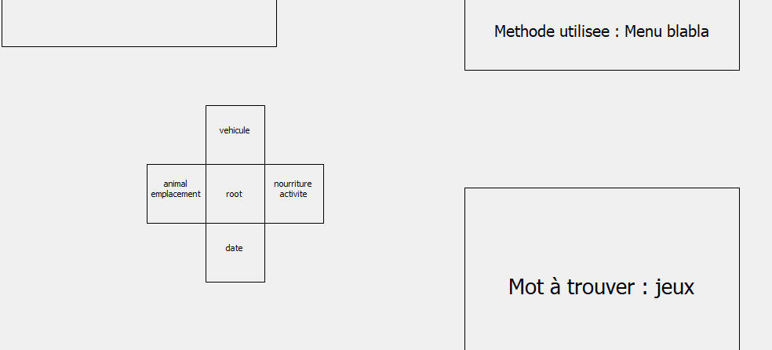
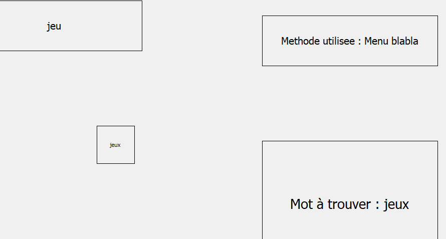

# **IHMA EValuation**

## **Contexte** 

Ce projet correspond au TP d'IHMA sur l'Évaluation. Pour plus de détails, veuillez consulter le [**compte-rendu**](./vFinal-Influence_Communicative_Keyboards-Screen.pdf)

## **Contenu**

* [**/media**](media) : contient les différents fichiers utilitaires du projet
  * [**/data**](media/data/) : contient les données utilisées lors des expériences
    * [**/menus**](media/data/menus) : contient les menus pré construits
      * [**/blabla**](media/data/menus/blabla)  : contient les menus pré construits qu'on utilisera avec le blabla menu 
      * [**/linear**](media/data/menus/linear)  : contient les menus pré construits qu'on utilisera avec le linear menu 
      * [**/marking**](media/data/menus/marking) : contient les menus pré construits qu'on utilisera avec le marking menu 
    * [**/sequences**]() : contient les séquences pré définies de sélections à faire lors des expériences
    * [**/fullMenu.csv**](media/data/fullMenu.csv) : contient la description du menu global de l'expérience
    * [**/logs.csv**](media/data/logs.csv) : contient les données résultats des expériences
  * [**/images**](media/images/) : contient des images d'illustrations du projet
* [**/src**](src) : contient les fichiers de code du projet
  * [**/MenuXP**](src/MenuXP/) : contient les codes relatifs à l'expérience
    * [**/ExpSetup.py**](src/MenuXP/ExpSetup.py) : code du questionnaire de début d'expérience
    * [**/MenuWidget.py**](src/MenuXP/MenuWidget.py) : code du widget de l'expérience contrôlée
    * [**/XPManager.py**](src/MenuXP/XPManager.py) : code de gestionnaire de l'expérience contrôlée
  * [**/Methods**](src/Methods/) : contient les différents codes de menus
    * [**/BlablaMenu.py**](src/Methods/BlablaMenu.py) : contient le code relatif au blabla menu
    * [**/LinearMenu.py**](src/Methods/LinearMenu.py) : contient le code relatif au menu linéaire
    * [**/MarkingMenu.py**](src/Methods/MarkingMenu.py) : contient le code relatif au marking menu
    * [**/Menu.py**](src/Methods/Menu.py) : contient le code relatif au concept abstrait de menu
  * [**/mainWindow.py**](src/mainWindow.py) : contient le code de la fenêtre principale du projet
* [**main.py**](main.py) : contient le code d'execution du projet
* [**readme.md**](readme.md) : fichier que vous lisez
* [**/vFinal-Influence_Communicative_Keyboards-Screen.pdf**](vFinal-Influence_Communicative_Keyboards-Screen.pdf) : version finale du rapport

## **Utilisation**

### **lancer l'expérience**

Tout d'abord, assurez vous d'avoir le module pyqt5 d'installé :

    pip install pyqt5

Ensuite, placé à la racine du projet, il vous faudra simplement lancer la commande suivante :

    python3 ./main.py

### **fichier ./media/data/fullMenu.csv**

En respectant le format établie et expliqué dans le rapport, vous pouvez disposer les mots que vous souhaitez dans votre menu complet. Par exemple, vous pouvez aisément ajouter ces lignes à la fin du fichier ./media/data/fullMenu.csv :

    2,nombre,100,110,120,130,140,150,160,170,180,190
    2,nombre,200,210,220,230,240,250,260,270,280,290
    2,nombre,300,310,320,330,340,350,360,370,380,390
    2,nombre,400,410,420,430,440,450,460,470,480,490
    2,nombre,500,510,520,530,540,550,560,570,580,590
    2,nombre,600,610,620,630,640,650,660,670,680,690
    2,nombre,700,710,720,730,740,750,760,770,780,790
    2,nombre,800,810,820,830,840,850,860,870,880,890
    2,nombre,900,910,920,930,940,950,960,970,980,990

### **lancer la création des fichiers**

Cependant, si vous modifiez les mots des menus, il vous faudra regénérer tout les fichiers (les menus et séquences préfaits). Rien de plus simple, après modification de ./media/data/fullMenu.csv (en respectant le format du fichier), vous pouvez lancer la commande suivante :

    python3 ./src/Methods/Menu.py

### **fichier ./media/data/logs.csv**

Une fois les fichiers recréés, les anciens logs ne seront plus pertinent dans votre nouvelle disposition de fichiers. Il vous faudra modifier le contenu de ./media/data/logs.csv par le contenu suivant :

    userId,age,niveau,nbRepetition,format,time,errors
     
Il faudra d'ailleurs passer une ligne à ce fichier pour que l'écriture ne se fasse pas à la suite de cette 1ere ligne

## **À savoir**

L'implémentation du blablaMenu n'a pas pu être terminée, car cela aurait pris trop de temps et n'aurait pas favoriser la note finale du projet.

Pour passer les étapes où nous sommes censé trouver un item avec le blabla Menu, un simple click sur l'écran suffit pour passer l'étape.

UPDATE : le BLABLA Menu est implémenté !

Pour l'utiliser, contrairement à ce qui était pensé dans le rapport, il faut maintenir la touche MAJ. Pour sélectionner un item, il faut que celui ci se trouve au milieu du menu. Les flèches sont possibles pour se déplacer dans le menu, il faut simplement appuyer sur la touche retour pour annuler le dernier mouvement. On peut également filtrer le menu en tapant un mot au clavier, là aussi il faut appuyer sur la touche retour pour annuler un caractère de filtrage. La touche retour annulera la dernière action effectuée. Pour filtrer ou se déplacer, il faut maintenir la touche MAJ, c'est en la relâchant qu'on valide la sélection.

<figure style="text-align:center;margin-right:30px;">

<figcaption> Blabla Menu initial
</figcaption>
</figure>
<figure style="text-align:center;margin-right:30px;">

<figcaption> Blabla Menu avec mot sélectionné
</figcaption>
</figure>

N'hésitez pas à me poser vos questions à cette email : [antoine.nollet@hotmail.fr](mailto:antoine.nollet@hotmail.fr)
